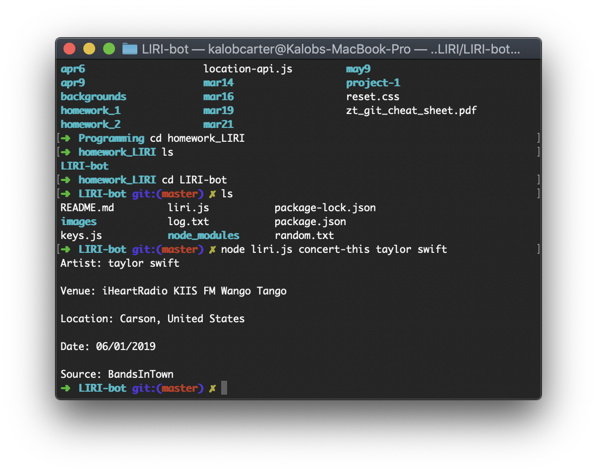

# LIRI-bot

An app running through Node that allows the user to find relevant data based on search terms such as movies, songs, or artist names.
Type "node liri.js" in Terminal, then your command followed by the search term and hit Enter to get results.

### concert-this

Use "node liri.js concert-this" followed by an artist's name to get an upcoming show with location, venue name, and date.

(./images/concert-this-default)
If you don't anything in the search area for artist name, then it will search the default artist, Tycho.

### spotify-this-song
(./images/spotify-this-song.png)
Use "node liri.js spotify-this-song" plus a song title to get info from Spotify about the track, including artist name, the album it appeared on, and a link to preview the song on Spotify.

(./images/spotify-this-song-default.png)
Again, if no search parameters are given then it will default, this time to "I Think it is Beautiful that You are 256 Colors Too" by Black Moth Super Rainbow.

### movie-this
(./images/movie-this)
Use "node liri.js movie-this" and the movie title you want to search for to get the plot, release date, as well as actors and country of origin for the film. The default in this case is Spirited Away.

### do-what-it-says
(./images/randomtxt-spotify)
(./images/randomtxt-movie)
Edit the text inside "random.txt" to give secret instructions to LIRI, which will interpret the text file then give you your results.
(./images/do-what-it-says-spotify)
(./images/do-what-it-says-movie)

### History
Check out "log.txt" to see your all of your results in one text file.
(./images/logtxt)